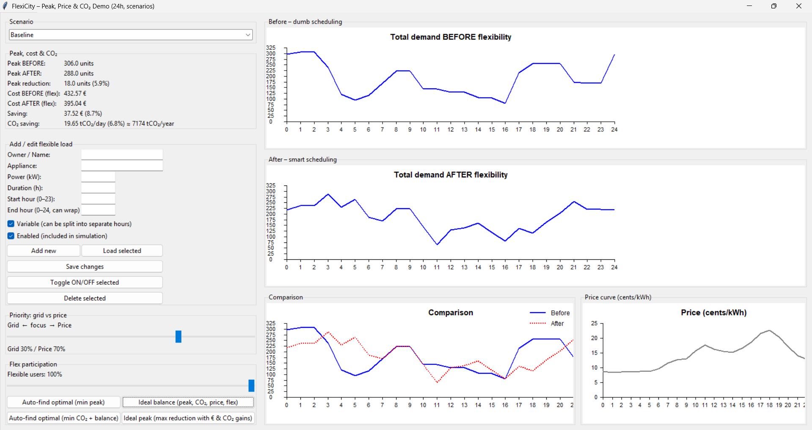

# FlexiCity – Helsinki Energy Peak Simulator

Built at **Urban Circular Hack Helsinki 2025**

---

## What is this?

Every evening around 7 pm, electricity in Helsinki gets expensive. People come home from work and all at the same time they charge their EVs, cook dinner, run the dishwasher, and heat their homes. This sudden rush pushes up electricity prices and strains the grid.

We used real price data from **Helen**, Helsinki's electricity provider, to show exactly when and why this happens — and built a simulator to show what would happen if people spread out their electricity use more evenly.

---

## The Problem — The 7 pm Spike

Using Helen's hourly price data, we found that electricity nearly **triples in price** between the middle of the night and the evening peak:

| Time | Price (cents/kWh) |
|------|-------------------|
| 02:00 | 8.52 (cheapest) |
| 17:00 | 18.60 ↑ rising |
| 18:00 | 21.53 ↑ |
| **19:00** | **22.68 — daily peak** |
| 21:00 | 17.09 ↓ falling |

This spike happens because everyone gets home from work at the same time and does the same things at once — plugging in their EV, turning on the oven, switching on heating. If people (or smart devices) could shift some of that load to cheaper hours, everyone saves money and the grid is more stable.

---

## What the Simulator Does

The app lets you see what happens to electricity demand across 24 hours if flexible devices (EV chargers, heat pumps, etc.) are scheduled smartly instead of all running at peak time.

**BEFORE** — everything runs whenever people normally use it (dumb scheduling)

**AFTER** — flexible devices are shifted to cheaper, lower-demand hours (smart scheduling)

You can adjust how many people participate and whether the focus is on saving money or reducing grid stress.

---

## Screenshot



The top graph shows demand before smart scheduling — you can clearly see the evening spike. The bottom graph shows how it flattens after. In this example run the simulator saved **€16.26 per day** and **3,453 tCO₂ per year** just by shifting when devices charge.

---

## How to Run It

**Requirements:** Python 3.8 or later (no extra libraries needed)

```bash
git clone https://github.com/KSou799/Urban-Circular-Hack-Helsinki-2025-Helsinki-Finland.git
cd Urban-Circular-Hack-Helsinki-2025-Helsinki-Finland
python Hackathon_energy.py
```

On Mac/Linux you may need `python3` instead of `python`.

---

## How to Use the App

1. Pick a **scenario** — Baseline, Winter, or 2030 future
2. Use the **Flex participation** slider to set how many people/devices shift their load
3. Use the **Grid vs Price** slider to choose whether to optimise for grid stability or cost savings
4. Watch the graphs and savings update live
5. Hit one of the **Auto-find** buttons to let the app find the best settings automatically

---

## Three Scenarios

**Baseline** — a typical Helsinki weekday

**Winter weekday** — much higher demand due to heating, EV use goes up, saunas are on 🇫🇮

**2030 future** — lots more EVs and electric heating, demand is 90% higher overall but the grid is cleaner thanks to more renewables

---

## Results from Our Analysis

Shifting flexible loads away from the 7 pm peak can achieve:
- Up to **€16+ saved per day** on electricity costs
- Up to **3,400+ tCO₂ avoided per year**
- A measurably flatter demand curve that's easier for the grid to handle

---

## Built With

Python + tkinter (standard library only — no pip installs needed)

---

## Team

Developed at **Urban Circular Hack Helsinki 2025**, Helsinki, Finland.

---

## License

MIT — free to use and modify.
